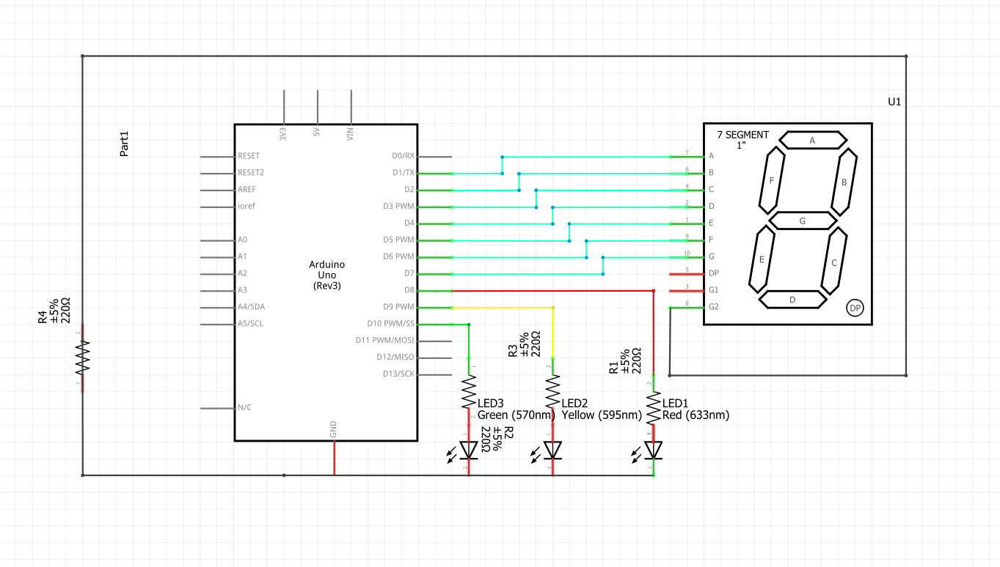
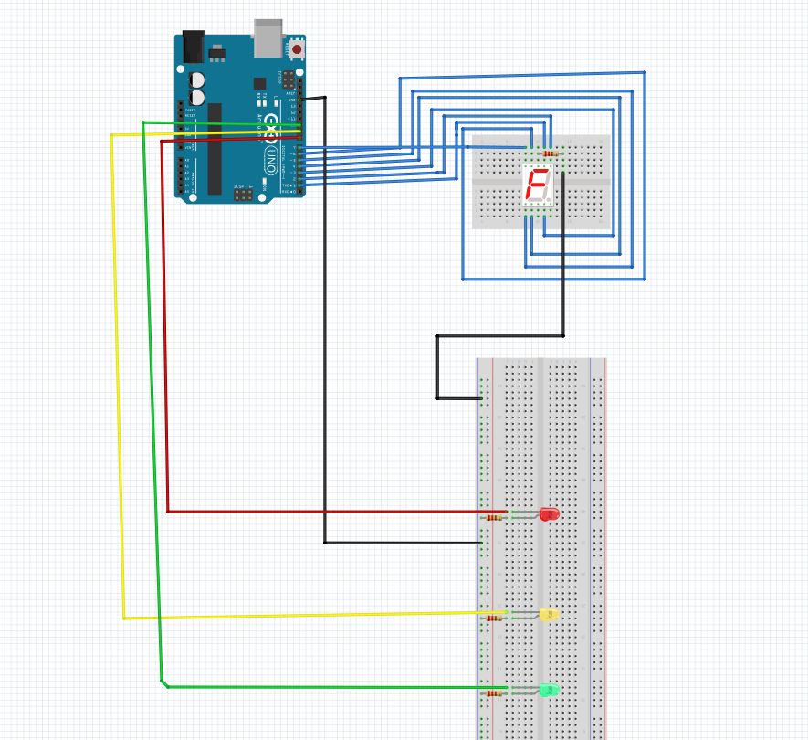

 ## Traffic light using 3 leds and a 7 segment display for countdown
 A simple traffic light configuration built on Arduino Uno using the 7 segment display as a countdown for the change of light.

 ### Why i did it?
 This is my first Arduino project and i built it because i think that the traffic light is a good way to learn to work with leds,wires,breadboards,7 segment displays and to learn coding concepts like digital output and timing/delays.

Code, wiring and component placement is done by me, the only external help was to learn how the components work and to debug.
 ### Features:
 + 3 Phases(red,green,green with flashing yellow to indicate the change to red)
 + Live timer showing the time to the next colour change
 + Adjustable phase durations(the original is 7 seconds between colour change)

### Components used:
   |Component | Quantity |
   | -- | -- |
   |Arduino Uno | 1 |
   |220Ω resistor | 4 |
   |7 segment display | 1 |
   | Breadbord | 2* |
   |Wires(male-to-male)| 11 |

   
   *I used one MB-102 breadboard(for the leds) and a mini breadboard for the display.

  
### Pin mapping:
|Component | Arduino pin |
   | --- | --- |
|Segment A| D1|
|Segment B| D2|
|Segment C| D3|
|Segment D| D4|
|Segment E| D5|
|Segment F| D6|
|Segment G| D7|
|Display common (G2)| GND|
|Red LED| D8|
|Yellow LED| D9|
|Green LED| D10|

### Code

Go to [trafficlightcode](trafficlightcode.ino) to see the code

### Video of it working

### Schematic

### Fritzing demonstration

   
   
